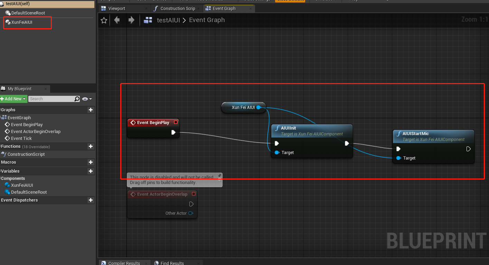

# Unreal_XunFeiAIUI_Plugin
Use the Xunfei AIUI plug-in to capture the sound in unreal and translate it into the corresponding text

## 
How to use
1. 到这个网址生成appID以及下载对应的AIUI SDK https://aiui.iflyos.cn/apps/add ，注意appid和sdk是强绑定的
2. 将对应的lib和dll拷贝到Plugins/XunFei_AIUI/XunFei目录下
3. 蓝图中如下所示：

4. 运行后，会一直处于mic监听状态，并自动进行静音检测
